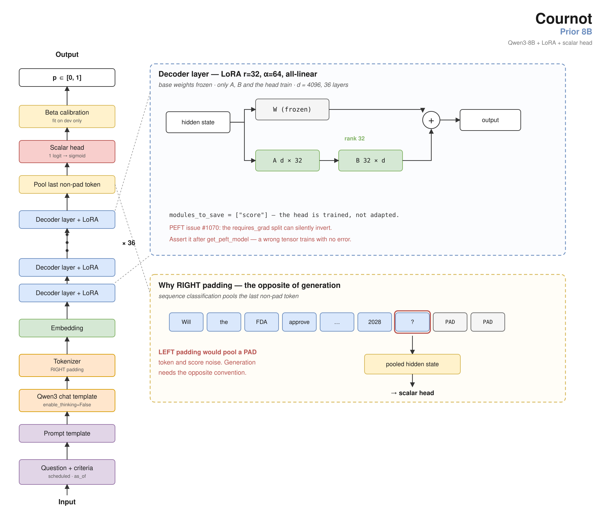

# Cournot Prior 8B

A **calibrated probability estimator** for binary questions about future events.
Given a question, its resolution criteria, its scheduled resolution date and an
`as_of` date, it returns a probability in [0, 1]. It conditions on the **question
text alone** — no retrieval, no news, no market price.

LoRA adapter + scalar regression head on `Qwen/Qwen3-8B`.



**Weights:** [`Laplace-AI-Research/cournot-prior-8b`](https://huggingface.co/Laplace-AI-Research/cournot-prior-8b)
on the Hugging Face Hub — LoRA adapter, 349 MB.
**Evidence:** [`Laplace-AI-Research/cournot-prior-8b`](https://github.com/Laplace-AI-Research/cournot-prior-8b)
on GitHub — the eval splits behind every claim, this model's raw forecasts
(including the venue transfers where it *failed*), the metric code, and
`verify.py`, which recomputes every number below without a model or a GPU.

The training corpus is **not** redistributed; `DATASHEET.md` documents its
composition, collection and known defects in its place. See
[Training data provenance and licensing](#training-data-provenance-and-licensing).

---

## The headline number

**Brier 0.1893** on 277 questions that resolved after a freeze date committed in
writing before it passed.

Reported the way the field's benchmark maintainers ask for it — a raw Brier with
its corpus, base rate and horizon attached, plus the decomposition — rather than
as a skill score against our own baseline. (ForecastBench built a
difficulty-adjustment methodology specifically because naive Brier/BSS
comparisons across different question sets have a rank correlation to true skill
of only ~0.64.)

| | published (headline) | dev (iteration only) |
|---|---:|---:|
| n | 277 | 3,000 |
| **Brier** | **0.1893** | 0.1674 |
| base rate | 0.4946 | 0.3970 |
| base-rate Brier (uncertainty) | 0.2500 | 0.2394 |
| Murphy calibration ↓ | 0.0048 | 0.0010 |
| Murphy resolution ↑ | 0.0627 | 0.0718 |
| ECE, equal-width / equal-mass (10 bins) | 0.0558 / 0.0525 | 0.0233 / 0.0260 |
| distinct output values | 83 | 99 |
| forecast sd | 0.250 | 0.283 |
| BSS vs base rate *(diagnostic, not a comparability claim)* | +24.3% | +30.1% |

Calibration is somewhat worse on published than on dev (ECE 0.056 vs 0.023) and
resolution is lower (0.063 vs 0.072). Both are what a smaller, harder, forward-
accumulating split tends to look like; neither currently rests on a single bin.
See [Known weaknesses](#known-weaknesses).

> **These numbers replaced an earlier set on 2026-08-27, and the reason is worth
> your attention.** The published split was found to be feeding the model each
> question's *actual resolution date* in place of its *scheduled close* —
> information not available at `as_of`. The split was rebuilt and the model
> re-scored. Full disclosure below under
> [The defect we found in our own evaluation](#the-defect-we-found-in-our-own-evaluation).

### For context, not as a comparison

ForecastBench's live *baseline* leaderboard (no tools, no retrieval) at time of
writing: superforecaster median 0.103, o3 0.145, Qwen3-235B-A22B 0.167,
Llama-3-8B-chat 0.178, zero-shot GPT-4 without retrieval 0.206. **These are
different questions, a different base rate, and a different horizon.** They tell
you the band we are in, not a ranking. We intend to submit to that leaderboard
so a real difficulty-adjusted comparison exists.

---

## Contamination

**Zero of the 3,000 dev questions and zero of the 277 published questions
resolved before the base model was released.** Outcome memorisation is therefore
closed by construction, not by argument.

- **Freeze: 2026-08-15**, committed in a dated, public git history *before* it
  passed. Anyone with the repository and a clock can check that nothing in the
  published split resolved before we committed to the freeze.
- The split is gated on **`Qwen3-8B`'s public release date (2025-04-29)**, not on
  a stated pretraining cutoff. This is deliberate: **Qwen3-8B publishes no data
  cutoff** — not in the technical report, not on the model card. A release date
  is externally checkable; a cutoff is a vendor claim.
- **88% of published questions (243/277) also *opened* after that release date**,
  and score **BSS +20.9% on their own** — so the result does not rest on
  questions that existed before the base model shipped.

**What this does not establish, and what has since been tested.** The published
split is Manifold-only, so on its own it shows the skill is not memorised
Manifold *outcomes* but cannot rule out a **Manifold-specific artifact**.

That second question has now been tested directly on a different venue — see
[Transfer](#transfer) — and the venue-specific reading is **refuted**: on Kalshi
Politics the model discriminates better than it does at home. What remains is not
a venue limit but a subject-matter one.

---

## Where it works, and where it does not

Forecasts are made at question **open** and compared against the Manifold crowd
price read at a fraction φ through each question's life. This is deliberately
unfair to us — the crowd has seen news we have not.

| horizon | crossover φ\* | our BSS at φ=0.10 | crowd BSS at φ=0.10 |
|---|---:|---:|---:|
| under 7 days | **never beats the crowd** | +6.9% | +15.6% |
| 7–30 days | 0.31 | +26.6% | +21.9% |
| 30–120 days | 0.46 | +33.6% | +20.8% |
| 120+ days | **0.62** | **+44.3%** | +19.4% |

**The supported claim:** on questions with a horizon beyond 30 days, this model
beats the Manifold crowd from question open through roughly the first half of the
question's life; past 120 days, through about 62% of it, at more than twice the
crowd's skill against the base rate. **On questions resolving within a week it
never beats the crowd at any point.**

The mechanism: the crowd's skill is roughly horizon-invariant (+15.6% → +19.4%
across the whole range) while ours rises steeply (+6.9% → +44.3%). We do not win
because the crowd degrades on long-horizon questions — we win because we improve
and it stays flat.

**The crowd-parity claim above is Manifold-only** — we have no price-series
comparison on another venue, so "beats the market" is not a claim this model
makes. The *skill* claim is broader and is set out under [Transfer](#transfer);
the *parity* claim is not.

---

## Transfer

**Skill crosses venues. It does not cross question types, and it does not reach
subjects without a public track record.**

Tested on 778 Kalshi judgment questions — a different venue, real money,
long-horizon (median lifetime 62 days), 99% opened after the base model's release,
and matched to the question *shape* this model is for.

| | n | Brier | calibration | resolution | 95% CI | BSS |
|---|---:|---:|---:|---:|---|---:|
| Manifold dev (home venue) | 3,000 | 0.1674 | 0.0010 | 0.0718 | — | +30.1% |
| **Kalshi — Politics** | 209 | 0.0789 | — | **0.1194** | [0.0886, 0.1565] | **+56.0%** |
| Kalshi — Science & Technology | 43 | 0.0902 | — | 0.0844 | [0.0227, 0.1514] | −6.9% |
| Kalshi — Economics | 63 | 0.2074 | — | 0.0686 | [0.0355, 0.1248] | +1.6% |
| **Kalshi — Elections** | 461 | 0.2278 | — | **0.0080** | [0.0044, 0.0215] | −23.1% |
| Kalshi — all | 778 | 0.1780 | 0.0345 | 0.0375 | [0.0278, 0.0510] | +2.2% |
| Polymarket (mechanical questions) | 3,000 | 0.2059 | 0.0239 | 0.0048 | — | −9.9% |

**On Kalshi Politics the model discriminates better off-venue than at home** —
resolution 0.1194 against 0.0718, with an interval whose lower bound sits above
the home figure.

**Read the aggregate with care.** The all-Kalshi row (+2.2%) is a composition
artifact: 59% of that corpus is obscure local elections dragging down a stratum
that beats the home venue. Neither number alone is honest; both are given.

**Calibration does not transfer even where discrimination does.** ECE is 0.156 on
Kalshi against 0.023 on Manifold dev. **A new venue needs its own calibration
mapping**, fit on that venue's own development split.

## Known weaknesses

Named specifically, because a limitations section that hedges generically is not
a limitations section.

**1. It needs the question's subject to have a public reference class.** This is
the sharpest limit, and it is not a venue limit — see [Transfer](#transfer).

On 461 Kalshi *Elections* questions the model collapses to resolution **0.0080**
[0.0044, 0.0215], BSS **−23.1%**. Those questions name obscure individuals in
local races — *"Will Peter Chatzky be the Democratic nominee for NY-17?"*, *"Who
will win the 2026 Ann Arbor Democratic mayoral primary?"* There is no reference
class for such a name in a text-only prior. **That is a lookup, not a forecast,
and this model cannot perform it.**

The same limit explains most of the Polymarket result below.

**2. It cannot do mechanical threshold or counting questions.** Questions of the
form *"Will Trump say 'X' this week?"* or *"Will TSA passengers on Feb 15 be
between 1,500,000 and 1,700,000?"* need a time series and precise arithmetic, not
a judgment prior. Frontier models score **13.5–16.0%** on date-duration
arithmetic against 58.6–76.3% on date addition ([Test of
Time](https://arxiv.org/abs/2406.09170), Table 8). Independently corroborated off-venue: **48% of a real-money venue's own
judgment-category markets are numeric-threshold questions**, and they are the
half we cannot do.

**3. It is weakest on sports.** On a keyword-identified sports subset (236
questions, 8% of dev): Brier 0.2379, resolution 0.0320, **BSS +4.8%** — against
+32.0% on everything else. Manifold publishes no category or tag metadata, so
this subset was identified by text keywords and **under-recalls**; treat 8% as a
lower bound and the subset as approximate. We report it because the opposite
worry (that the headline was propped up by sports) is a reasonable one and the
data refutes it — excluding sports *raises* the aggregate.

**4. Calibration is worse on published than on dev**, ECE 0.056 vs 0.023, and
resolution is lower, 0.063 vs 0.072. No single bin is responsible: the largest
equal-width reliability gap is **−0.184 in the 0.2–0.3 band at n=13**, and the
mid-range bands that carry most of the mass are close — 0.5–0.6 is n=47 at
−0.030, 0.4–0.5 is n=63 at −0.097.

An earlier version of this card attributed the published-split calibration gap to
one 13-question bin at 0.52–0.59. **That bin does not survive the corrected
split** (see below); the gap is now smaller and diffuse rather than concentrated.
We are recording the change rather than quietly restating the conclusion.

The honest reading at n=277 is that published is a smaller and somewhat harder
sample than dev, not that a specific defect has been located. It will be
re-checked as the split accumulates — the forward accrual is the only thing that
settles it.

**5. It is trained at a single `as_of`.** Every training example uses
`as_of = open_date`, so the model is off-distribution at any later `as_of` and
degrades as `as_of` moves toward resolution. A varied-`as_of` training arm was
run and **failed**: it flattened the horizon curve by hedging, losing resolution
at every φ. The defect stands, unfixed.

**6. Single model, no ensemble.** Calibration under distribution shift is the
known fragile regime for single models ([Ovadia et
al.](https://arxiv.org/abs/1906.02530)); ensembling was the only method they
found robust. We do not ensemble.

---

## Intended use

**In scope.** Binary questions about future events that are (a) **long-horizon**,
beyond ~30 days, and (b) about **subjects with a public track record** — an
institution, an office, a well-known organisation or person. A cheap prior to be
updated by other evidence; cold-start estimates where no market exists; research
on calibration and forecasting. Validated on two independent venues (Manifold,
Kalshi) under those two conditions.

**Out of scope.**
- Questions resolving **within a week** — it never beats the crowd there.
- **Mechanical threshold, counting or arithmetic** questions.
- Questions about **subjects with no public reference class** — a local primary
  candidate, a private individual, an obscure entity. This is the sharpest limit
  and the model gives *worse than base-rate* answers in this regime.
- Any **new venue without a fresh calibration mapping**. Discrimination transfers;
  calibration does not.
- Any setting where a miscalibrated probability causes harm — this model has **no**
  evidence channel and cannot know anything that happened after its base model was
  trained.

**Never** use it as the sole input to a consequential decision. It is a prior.

---

## Evaluation data

- **`published`** (headline, n=277) — Manifold questions resolving after
  2026-08-15. Never trained on, contamination-free by construction. Accumulates
  forward; the only source of an external number. Built by
  `scripts/published_eval_set.py`, which refuses any question whose scheduled
  close time is unknown rather than substituting a default — see below for why
  that refusal exists.
- **`dev`** (n=3,000) — resolving 2025-08-15 to 2026-08-15. Gates iteration.
  **Never published as a headline claim.**
- **Parity** (n=1,741) — the subset with a usable price series, for crowd
  comparison at five values of φ. Each question appears once per φ; rows are
  **not independent** and must be compared within φ, paired on question id.

All intervals are paired, question-clustered bootstraps (10,000 resamples).
Seed-to-seed noise on this setup is **±0.003 Brier**, so smaller differences are
not findings.

---

## The defect we found in our own evaluation

On **2026-08-27**, before this model was released publicly, we found that the
published evaluation split had been feeding the model information it could not
have had.

**What it was.** Every forecast prompt carries a resolution date. The date a
forecaster actually has at `as_of` is the question's **scheduled close**. Our
published split was supplying the date the question **actually resolved** — on
132 of 132 rows. The corresponding figure on `dev`, which is built from a
different source, was 37.7%.

**How it happened.** The script that collects post-freeze questions from the
Manifold API recorded the title, resolution and creation time but **dropped
`closeTime`**, a field present in the same API response. With no close time
available, whatever built the eval set filled the gap with the resolution time.

**Why it went unnoticed.** `published_eval.json` had **no builder script**. It
entered the repository as a committed JSON file with no code behind it, so it
could not be regenerated, diffed or reviewed. The defect lived in the one
artifact in the pipeline nobody could reproduce. That is the part we consider
most instructive.

**What we fixed.** The collector now captures `closeTime`; a backfill recovered
it for questions already gathered; and the split is now built by
`scripts/published_eval_set.py`, which **refuses a question with no close time
rather than defaulting one**, because defaulting is how the defect entered. The
builder reproduces the previously shipped rows field-for-field and is
mutation-tested.

**What changed, and what we cannot claim.** The corrected split is larger (277 vs
132, partly from forward accrual) and its fields now match `dev`'s semantics
(41.9% vs 37.7% coincidental matches), so the two are commensurable for the first
time. Headline Brier moved 0.1800 → 0.1893, calibration 0.0241 → 0.0048, ECE
0.104 → 0.056.

**We cannot attribute those changes to the fix.** On the 132 questions common to
both, holding weights and adapter constant and changing only the prompt field, the
paired question-clustered interval is **+0.0070 Brier [−0.0155, +0.0330]** and
**−0.0118 resolution [−0.0376, +0.0143]** — both spanning zero, and underpowered:
the Brier half-width is 3.5× the effect, and detecting it would need n≈1,584. The
difference between the old and new headline is dominated by the split containing
different questions, not by the correction.

So the honest statement is not "the old number was inflated." It is: **the old
number was produced under a defective input, and the magnitude of that defect is
below what this sample can measure.** The fix is justified by the leak itself,
not by its measured effect.

Derivation: `docs/10-decisions.md`, entries 2026-08-27o and 2026-08-27u, in the
research repository.

---

## Training

- **Base:** `Qwen/Qwen3-8B` (Apache 2.0), LoRA r=32 α=64 dropout=0.05,
  `all-linear`, plus a trainable scalar head (`modules_to_save=["score"]`).
- **Objective:** Brier/MSE loss on a scalar output against the **terminal 0/1
  outcome**. Under a proper scoring rule a 0/1 label is an unbiased Bernoulli
  observation; on our corpus it beat a lower-variance market-price target on
  resolution, because the price target is biased.
- **Corpus:** 81,870 resolved Manifold questions, all resolving before
  2025-08-14.
- **Footing:** chat template on **both** train and score. This is load-bearing —
  a mismatch here silently invalidated an earlier headline result — and was
  re-established empirically by reproducing stored forecasts (mean abs diff
  0.0018 with template, 0.2015 without).
- **Padding:** right. The head pools the last non-pad token — the opposite
  convention from generation.
- **Calibration:** beta calibration, fit on `dev`, never on `published`.

**Reproduction note:** `transformers >= 4.51.0` is required for
`Qwen3ForSequenceClassification`; `config.pad_token_id` must be set explicitly.

---

## Training data provenance and licensing

The corpus is derived from the Manifold Markets public API.

**Manifold's terms restrict bulk API data to personal and non-commercial use, and
state that it may not be used to train machine learning models for commercial
purposes without a data licence** (data@manifold.markets). This adapter is
released under **CC BY-NC 4.0** on that basis — research and non-commercial use.
Anyone intending commercial use must obtain that licence from Manifold
independently; it is not ours to grant.

The raw corpus is **not redistributed**. A datasheet describing its composition,
collection and known defects is published in its place.

The base model's own licence (Apache 2.0) is unaffected and permits commercial
use of the base weights.

---

## Reproducing

Every headline number in this card is recomputed from the shipped forecasts by
`verify.py` — **no model, no GPU, no network**:

```bash
uv run python verify.py
```

To regenerate those forecasts from the weights instead:

```bash
uv run python scripts/scalar_score.py \
  --adapter Laplace-AI-Research/cournot-prior-8b \
  --set eval/published_eval.json \
  --out published.jsonl \
  --chat-template
```

Every eval run writes a manifest carrying model hash, data snapshot hash, eval
split id and git SHA. Numbers without a manifest are not comparable.

---

## Citation and provenance of claims

Every number in this card is derived in `docs/10-decisions.md`, which also
records the results that **failed** — a varied-`as_of` arm that hedged, a
mixed-venue arm that traded Manifold resolution for Polymarket robustness, two
claims that died under a paired bootstrap, and a citation we retracted after
failing to find it in the paper we had attributed it to.
